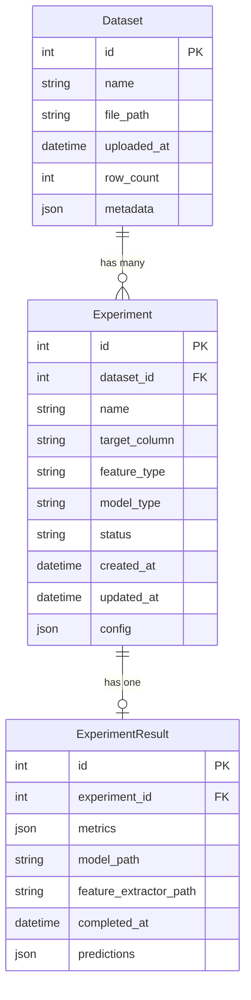

# データベーススキーマドキュメント

Chemical ML Platformのデータベース構造を説明します。

## 📊 ER図



## 🗂️ テーブル定義

### Dataset（データセット）

| カラム | 型 | NULL | 説明 |
|--------|-----|------|------|
| `id` | Integer | No | 主キー |
| `name` | String(200) | No | データセット名 |
| `file` | FileField | No | CSVファイルパス |
| `uploaded_at` | DateTime | No | アップロード日時 |
| `row_count` | Integer | No | 行数 |
| `metadata` | JSONField | Yes | メタデータ（列名、型等） |

**インデックス**:
- `uploaded_at` (降順)

---

### Experiment（実験）

| カラム | 型 | NULL | 説明 |
|--------|-----|------|------|
| `id` | Integer | No | 主キー |
| `dataset_id` | Integer | No | 外部キー → Dataset |
| `name` | String(200) | No | 実験名 |
| `target_column` | String(100) | No | ターゲット列名 |
| `feature_type` | String(50) | No | 特徴量タイプ（rdkit/xtb/uma） |
| `model_type` | String(50) | No | モデルタイプ（xgboost/lightgbm/rf） |
| `status` | String(20) | No | ステータス（pending/running/completed/failed） |
| `created_at` | DateTime | No | 作成日時 |
| `updated_at` | DateTime | No | 更新日時 |
| `config` | JSONField | Yes | 設定（ハイパーパラメータ等） |

**インデックス**:
- `dataset_id`
- `status`
- `created_at` (降順)

**ステータス値**:
- `pending`: 待機中
- `running`: 実行中
- `completed`: 完了
- `failed`: 失敗

---

### ExperimentResult（実験結果）

| カラム | 型 | NULL | 説明 |
|--------|-----|------|------|
| `id` | Integer | No | 主キー |
| `experiment_id` | Integer | No | 外部キー → Experiment（One-to-One） |
| `metrics` | JSONField | No | 評価指標（R², MAE, RMSE等） |
| `model_path` | String(500) | No | モデルファイルパス |
| `feature_extractor_path` | String(500) | Yes | 特徴量抽出器パス |
| `completed_at` | DateTime | No | 完了日時 |
| `predictions` | JSONField | Yes | 予測結果（オプション） |

**インデックス**:
- `experiment_id` (Unique)
- `completed_at` (降順)

**metricsフィールドの例**:
```json
{
  "r2": 0.85,
  "mae": 0.23,
  "rmse": 0.31,
  "train_r2": 0.92,
  "cv_scores": [0.83, 0.86, 0.84, 0.87, 0.85]
}
```

---

## 🔄 リレーションシップ

### Dataset → Experiment
- **関係**: One-to-Many
- **カスケード削除**: `on_delete=CASCADE`（データセット削除時に実験も削除）

### Experiment → ExperimentResult
- **関係**: One-to-One
- **カスケード削除**: `on_delete=CASCADE`（実験削除時に結果も削除）

---

## 📝 使用例

### データセット作成

```python
from core.models import Dataset

dataset = Dataset.objects.create(
    name="Solubility Dataset",
    file="datasets/solubility.csv",
    row_count=1000,
    metadata={"columns": ["smiles", "logS"], "types": {"logS": "float"}}
)
```

### 実験作成

```python
from core.models import Experiment

experiment = Experiment.objects.create(
    dataset=dataset,
    name="XGBoost Solubility Prediction",
    target_column="logS",
    feature_type="rdkit",
    model_type="xgboost",
    status="pending",
    config={"n_estimators": 100, "max_depth": 6}
)
```

### 結果保存

```python
from core.models import ExperimentResult

result = ExperimentResult.objects.create(
    experiment=experiment,
    metrics={"r2": 0.85, "mae": 0.23, "rmse": 0.31},
    model_path="models/experiment_1_model.pkl",
    feature_extractor_path="models/experiment_1_extractor.pkl"
)

# 実験ステータス更新
experiment.status = "completed"
experiment.save()
```

---

## 🔍 よく使うクエリ

### 最新の実験を取得

```python
latest_experiments = Experiment.objects.order_by('-created_at')[:10]
```

### 完了した実験とその結果

```python
completed_experiments = Experiment.objects.filter(
    status='completed'
).select_related('result')

for exp in completed_experiments:
    print(f"{exp.name}: R² = {exp.result.metrics['r2']}")
```

### データセットごとの実験数

```python
from django.db.models import Count

dataset_stats = Dataset.objects.annotate(
    experiment_count=Count('experiment')
).values('name', 'experiment_count')
```

---

## 🚀 マイグレーション

### 新しいフィールドを追加

```python
# core/migrations/0002_add_description.py
from django.db import migrations, models

class Migration(migrations.Migration):
    dependencies = [
        ('core', '0001_initial'),
    ]
    
    operations = [
        migrations.AddField(
            model_name='experiment',
            name='description',
            field=models.TextField(blank=True, default=''),
        ),
    ]
```

### マイグレーション実行

```bash
python manage.py makemigrations
python manage.py migrate
```

---

## 📊 パフォーマンス最適化

### インデックスの追加

```python
class Experiment(models.Model):
    # ...
    class Meta:
        indexes = [
            models.Index(fields=['status', '-created_at']),
            models.Index(fields=['dataset', 'feature_type']),
        ]
```

### クエリ最適化

```python
# 悪い例（N+1問題）
for exp in Experiment.objects.all():
    print(exp.dataset.name)  # 各実験ごとにクエリ発行

# 良い例
for exp in Experiment.objects.select_related('dataset'):
    print(exp.dataset.name)  # 1回のJOINクエリ
```

---

## 🔐 セキュリティ考慮事項

- **ファイルパス**: ユーザー入力を直接ファイルパスに使用しない
- **JSONフィールド**: 信頼できないデータの検証を行う
- **カスケード削除**: 重要なデータは論理削除を検討

---

## 📚 関連ドキュメント

- [Django Models Documentation](https://docs.djangoproject.com/en/4.2/topics/db/models/)
- [ARCHITECTURE.md](../ARCHITECTURE.md)
- [core/models.py](../core/models.py)
